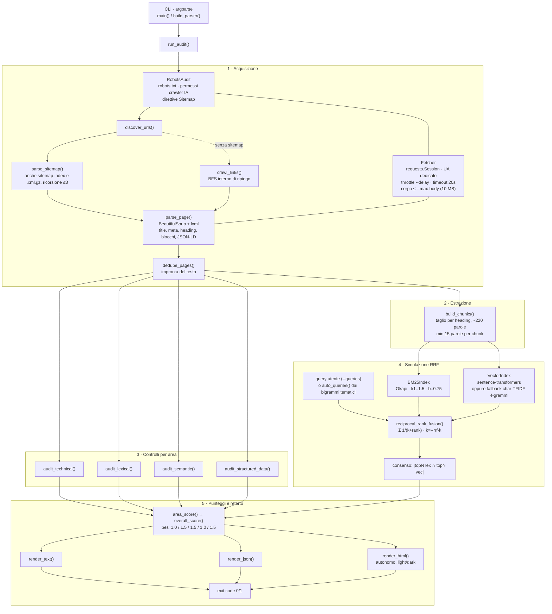
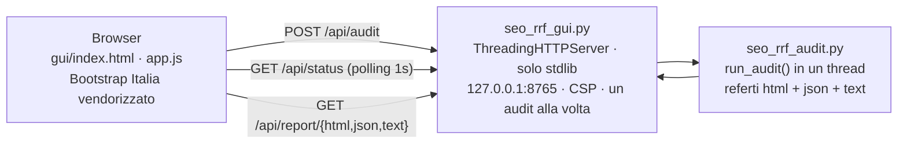

# SEORRF — Audit SEO + Reciprocal Rank Fusion

Strumento (Python 3, file singolo, ~2.000 righe, licenza MIT)
che misura quanto un sito è **recuperabile e citabile dai motori di
ricerca ibridi e dagli assistenti IA** (ChatGPT, Claude, Perplexity, Google AI
Overviews). Oltre ai controlli SEO classici, riproduce localmente la pipeline
di recupero che questi motori usano davvero: due recuperatori indipendenti
(lessicale BM25 e vettoriale) fusi con la formula del **Reciprocal Rank
Fusion**:

```
score(d) = Σᵢ 1 / (k + rankᵢ(d))        con k = 60 di default
```

Il segnale operativo chiave non è il punteggio assoluto ma il **consenso**:
quante volte lo stesso passaggio del sito compare in alto in *entrambe* le
liste. Un documento presente in due liste somma due addendi e batte chi domina
una lista sola (con k=60: 2° lessicale + 3° semantico = 1/62 + 1/63 ≈ 0,0320 >
1° in una sola lista = 1/61 ≈ 0,0164).

## Contenuto del repository

| File | Descrizione |
|---|---|
| [seo_rrf_audit.py](seo_rrf_audit.py) | Lo strumento: CLI autonoma, PEP8, `flake8` pulito |
| [seo_rrf_gui.py](seo_rrf_gui.py) | Interfaccia web locale: server stdlib che pilota lo script ed espone i referti |
| [seo_rrf_citations.py](seo_rrf_citations.py) | Monitoraggio periodico delle citazioni IA effettive (Claude, Perplexity) con storico e soglie |
| [gui/](gui/) | Frontend Bootstrap Italia in vanilla JS (asset vendorizzati, funziona offline) con tema Lympha Technologies |
| [deploy/](deploy/) | Unit systemd per l'esecuzione come servizio automatico sulle macchine dei clienti |
| [.github/workflows/ci.yml](.github/workflows/ci.yml) | CI GitHub Actions: flake8 + pytest multi-Python + audit accessibilità Pa11y |
| [tests/](tests/) | Suite pytest: unit test del nucleo numerico, fixture site locale, end-to-end CLI e GUI |
| [AS-IS.md](AS-IS.md) | Stato di fatto: tutto ciò che è già realizzato e verificato |
| [TO-DO.md](TO-DO.md) | Ciò che resta da fare: bug noti, sviluppi e idee di miglioramento |
| [seo_rrf_audit.md](seo_rrf_audit.md) | Nota tecnica di consegna: uso, verifiche eseguite, difetti corretti, fonti |
| [audit_miaweb_rrf.html](audit_miaweb_rrf.html) | Esempio di referto di consulenza (www.miaweb.art, 2026-08-03), redatto a partire dai dati del tool con verdetto sintetico e piano d'azione per priorità |

## Installazione

```bash
pip install -r requirements.txt                 # requests, bs4, lxml
pip install sentence-transformers numpy         # opzionali: embedding reali
pip install playwright                          # opzionale: rendering JS
playwright install chromium                     # (o usa Chrome di sistema)
```

> **Nota per macOS Intel (x86_64).** PyTorch per macOS x86 si ferma alla
> 2.2.2, quindi le versioni recenti di transformers/sentence-transformers
> (che richiedono torch ≥ 2.4) non possono funzionare. La combinazione
> compatibile è:
> `pip install "torch==2.2.2" "numpy<2" "transformers==4.46.3" "sentence-transformers==3.2.1"`.
> Con un'installazione incompatibile lo strumento ripiega comunque sul
> proxy char-TFIDF, dichiarando il motivo nel log.

> **Nota su Hugging Face Hub.** Al primo utilizzo il modello di
> embedding viene scaricato dall'HF Hub e poi resta in cache locale.
> Le richieste non autenticate funzionano normalmente (dalla v1.14.1
> i relativi avvisi e le barre di download non sporcano più il log);
> se vuoi limiti di velocità più alti esporta `HF_TOKEN` — le
> librerie lo leggono da sole, lo strumento non lo tocca.

Con `sentence-transformers` installato gli embedding reali si attivano da
soli (modello multilingue predefinito `paraphrase-multilingual-MiniLM-L12-v2`;
`--embeddings none` forza il proxy). Senza libreria il recupero "semantico"
ripiega su un coseno TF-IDF di 4-grammi di caratteri: un **proxy morfologico,
non una vera rappresentazione semantica**. Lo script dichiara sempre la
modalità usata (`char-tfidf` oppure `embeddings:<modello>`) in tutti i
formati di referto.

## Uso

```bash
python3 seo_rrf_audit.py https://esempio.it
python3 seo_rrf_audit.py https://esempio.it --format html --output report.html
python3 seo_rrf_audit.py https://esempio.it --max-pages 40 --queries query.txt
python3 seo_rrf_audit.py https://esempio.it \
    --embeddings paraphrase-multilingual-MiniLM-L12-v2
```

### Opzioni

| Opzione | Default | Effetto |
|---|---|---|
| `--max-pages N` | 25 | numero massimo di pagine analizzate |
| `--queries FILE` | — | una query per riga; se omesso le query sono auto-generate dai bigrammi tematici di heading e title, **nella lingua prevalente del sito** (it/en/fr/de/es dall'attributo `lang`; default italiano) |
| `--queries-gsc CSV` | — | **query reali da Google Search Console**: l'export CSV "Query" del rapporto Rendimento (intestazioni it/en, virgola o punto e virgola) — prime 15 per clic e impressioni, deduplicate. La simulazione RRF gira sulle domande vere degli utenti invece che sui bigrammi. Non combinabile con `--queries` |
| `--embeddings MODELLO` | auto | modello sentence-transformers per il recupero vettoriale reale. Se omesso e la libreria è installata viene usato il modello multilingue predefinito; `none` forza il proxy char-TFIDF |
| `--rrf-k N` | 60 | costante k della formula RRF (propagata a tutti i renderer) |
| `--top-n N` | 5 | posti fusi considerati per query (1–20): governa il consenso e la share of voice |
| `--rrf-weights LES,VET` | 1,1 | **variante RRF pesata**: pesi delle due liste (lessicale, vettoriale) nella fusione `score(d)=Σ wᵢ/(k+rankᵢ)`; `1,1` è l'RRF classico |
| `--chunk-words N` | 220 | dimensione obiettivo dei chunk in parole (80–600); il taglio segue comunque gli heading |
| `--delay SEC` | 0.5 | pausa fra le richieste HTTP |
| `--competitor URL` | — | sito concorrente da confrontare (ripetibile, massimo 3). Ogni concorrente viene scansionato con gli stessi limiti; i corpora vengono fusi negli stessi indici BM25+vettoriale e interrogati con le stesse query (i temi del **tuo** sito): il referto riporta la **share of voice** — quanti dei primi 5 posti fusi appartengono a ciascun sito, con soglie rispetto alla parità — e le query vinte interamente dai concorrenti |
| `--market occidentale\|globale\|orientale` | occidentale | pesi dei **profili di citabilità per assistente IA** nell'indice composito: `occidentale` privilegia ChatGPT/Perplexity (50%) e Claude (30%), `orientale` Qwen e Kimi (35% ciascuno), `globale` pesa tutti allo stesso modo. I profili sono stime euristiche derivate dai punteggi di area — la nota di onestà è sempre inclusa nel referto |
| `--history FILE` | — | **storico JSONL delle esecuzioni**: legge l'ultima riga dello stesso sito e riporta nei referti la sezione "Rispetto all'esecuzione precedente" (variazioni dei punteggi per area, rilievi nuovi/risolti), poi accoda una riga compatta per l'esecuzione corrente. Con un audit schedulato (cron/systemd) trasforma l'audit in monitoraggio anche senza GUI |
| `--judge auto\|on\|off` | auto | **giudizio LLM sulla citabilità**: un modello (Claude, SDK ufficiale Anthropic) valuta i passaggi migliori della simulazione RRF — max 5, una sola richiesta API per audit — con punteggio e motivazione per ciascuno e **scarto rispetto all'indice euristico**. `auto` (default) parte solo se `ANTHROPIC_API_KEY` è nell'ambiente, altrimenti viene saltato con motivo dichiarato nel referto: senza chiave l'audit resta interamente offline. `on` pretende la chiave (errore d'uso senza); `off` disattiva. I costi API sono a carico della chiave configurata |
| `--render off\|auto\|always` | off | rendering JavaScript in browser headless (richiede Playwright; ripiega sul Chrome/Chromium di sistema). `auto` rende **solo** le pagine che l'euristica classifica come client-side; `always` tutte. Il DOM renderizzato sostituisce l'estrazione del contenuto, ma stato HTTP, redirect e tempi restano quelli della risposta reale, e il rilievo critico sul contenuto invisibile ai crawler senza JS scatta comunque. Rendering seriale, rispetta `--delay` e l'annullamento |
| `--workers N` | 4 | richieste in parallelo durante la scansione (1–16; `1` = seriale). Il **ritmo verso il sito non cambia**: gli avvii delle richieste restano distanziati di `--delay` anche fra thread — i worker sovrappongono solo le attese di rete, quindi il tempo per pagina tende a `max(delay, latenza)` invece di `delay + latenza` |
| `--retries N` | 2 | tentativi aggiuntivi con backoff esponenziale (0,5 s → 1 s → 2 s, tetto 8 s) su errori di rete e HTTP 429/500/502/503/504, rispettando l'header `Retry-After`. Gli altri stati (404, 403…) non vengono ritentati: sono segnali diagnostici dell'audit. `0` disattiva |
| `--user-agent UA` | UA dello strumento | header `User-Agent` inviato con ogni richiesta. Il predefinito identifica lo strumento (`SeoRrfAudit/versione`) e rimanda alla pagina del progetto su GitHub, così chi legge i log del server sa chi è il bot |
| *(robots.txt)* | rispetta | **dalla v1.13.0 i `Disallow` per l'agente `SeoRrfAudit` sono rispettati di default**: gli URL vietati non vengono scaricati e sono elencati nel referto. `--own-site` dichiara il sito di tua titolarità e li analizza comunque (i concorrenti restano protetti); `--ignore-robots accetto` li ignora ovunque, con accettazione **esplicita** di responsabilità (il valore letterale "accetto" è obbligatorio). `--respect-robots` resta accettato ma è deprecato (ora è il default) e non si combina con gli altri due |
| `--max-body MB` | 10 | tetto al corpo di ogni risposta: lo scarico avviene a blocchi e si interrompe al superamento (o subito, se il `Content-Length` dichiarato eccede). Il corpo resta in RAM durante l'analisi: dimensiona il valore sulla memoria della tua macchina, di norma non oltre un decimo della RAM disponibile — lo script stesso avvisa all'avvio se il valore scelto è alto per la macchina in uso |
| `--format text\|json\|html` | text | formato del referto. Il JSON dichiara `schema_version` (oggi `1`): si incrementa solo per cambi incompatibili della struttura — è il numero su cui fare il gate nelle integrazioni |
| `--output FILE` | stdout | scrive il referto su file |
| `--quiet` | — | sopprime l'avanzamento su stderr |
| `--version` | — | stampa la versione |

### Codici di uscita

`0` nessuna criticità · `1` almeno una criticità · `2` errore d'uso ·
`130` interruzione utente. Adatto all'uso in CI come gate di qualità.

## Interfaccia grafica locale

```bash
python3 seo_rrf_gui.py            # apre http://127.0.0.1:8765/
python3 seo_rrf_gui.py --port 9000 --no-browser
```

Interfaccia web in **Bootstrap Italia** (vanilla JavaScript, nessun
framework) per configurare l'audit da modulo, seguire l'avanzamento in
tempo reale e fruire direttamente del referto. Non richiede dipendenze
oltre a quelle dello script: il server è solo libreria standard e gli
asset di Bootstrap Italia sono vendorizzati in `gui/vendor` (funziona
anche senza rete). Una sola scansione del sito produce tutti e tre i
formati di referto.

Cosa offre:

- **Modulo di configurazione** con tutti i parametri della CLI (URL,
  pagine massime, pausa, `--max-body` con suggerimento calcolato sulla
  RAM disponibile della macchina, ritentativi sugli errori transitori,
  rispetto dei `Disallow` del robots.txt, query di prova, modello di
  embedding con avviso se sentence-transformers non è installato,
  costante k) e validazione con messaggi in italiano.
- **Account utente**: registrazione rapida (nome, email, password e
  accettazione delle condizioni di servizio, con dichiarazione che il
  sito analizzato è di propria proprietà) oppure login; il check
  richiede l'accesso e ogni utente può avviarne **uno all'ora**. Il
  download dei referti è riservato alla **registrazione completa**
  (azienda e telefono nel profilo). Utenti e sessioni su SQLite
  locale, password con hash PBKDF2 e salt.
- **Avanzamento in tempo reale**: push via Server-Sent Events (con
  ripiego automatico sul polling), fase corrente annunciata via regione
  di stato, log di scansione completo in area scorrevole e bottone
  **"Annulla audit"** (stop cooperativo: interrompe richieste e attese
  alla prima occasione utile, senza risultati parziali; non consuma
  lo slot orario).
- **Storico degli audit** per utente: tabella delle esecuzioni con
  delta del punteggio rispetto al run precedente dello stesso sito e
  grafico dell'andamento del punteggio complessivo con soglie 40/70.
  Il **referto JSON completo di ogni esecuzione è salvato nel
  database** ed esportabile per riga (`/api/history/report?id=N`,
  riservato al proprietario con profilo completo); a fine audit i
  risultati mostrano il blocco **"Rispetto all'esecuzione
  precedente"**: delta dei punteggi per area e rilievi
  **nuovi/risolti** rispetto all'ultimo audit dello stesso dominio —
  l'audit diventa monitoraggio.
- **Preimpostazioni**: la configurazione del form si salva con un nome
  (per cliente/sito) in localStorage e si ricarica in un click.
- **Citazioni IA nel tempo**: la GUI legge lo storico JSONL del
  monitoraggio citazioni (`--citations-history`, default
  `citazioni.jsonl` accanto agli script) e mostra la tendenza per
  provider (delta fra esecuzioni), il grafico multilinea del tasso di
  citazione (una linea per provider più il complessivo) e la tabella
  con tutti i valori — il ciclo si chiude: audita, correggi, misura le
  citazioni reali.
- **Risultati nella pagina**: punteggi per area con barre e valori
  testuali, **profili di citabilità per assistente IA** (barre per
  profilo, indice composito col mercato scelto nel form e "top
  azioni prioritarie" con il profilo che guadagna di più da ogni
  intervento), rilievi in una fisarmonica per area con gravità
  espressa da testo + simbolo (mai solo colore), tabella del
  consenso RRF per query, **piano di remediation** con esempi di fix
  pronti da copiare, **confronto competitivo** (barre della share of
  voice per sito e tabella per query, quando si indicano
  concorrenti) e scarico dei referti HTML / JSON / testo (il referto
  HTML si apre in una nuova scheda).

Accessibilità (obiettivo WCAG 2.2 AA): audit automatico Pa11y in CI su
pagine reali (vedi [docs/ACCESSIBILITA.md](docs/ACCESSIBILITA.md), che
documenta anche il protocollo di verifica manuale con screen reader);
pagina in italiano con landmark
e gerarchia di heading corretti, skip link, etichette e descrizioni su
ogni campo, errori identificati sul campo e in un riepilogo con focus
gestito, aggiornamenti di stato via `role="status"`, aree scorrevoli
raggiungibili da tastiera, contrasti dei colori di gravità ≥ 4.5:1,
animazioni disattivate con `prefers-reduced-motion`, componenti
Bootstrap Italia (fisarmonica, moduli) usati con la semantica ARIA
prevista. La struttura è verificata con un lint automatico (id, label,
riferimenti ARIA, heading); resta consigliata una verifica manuale con
screen reader.

**Brand Lympha Technologies.** Il look & feel è allineato a
lymphatech.it, che usa a sua volta Bootstrap Italia: la GUI carica il
layer di token del brand (`gui/brand/lympha-brand.css`, la stessa
palette `--lt-*` del sito con i contrasti AA documentati) più un tema
applicativo (`gui/theme.css`) che replica header bianco con marchio,
bottoni teal, footer teal scuro e focus arancione. Logo
(`lympha-mark.svg`) e favicon sono vendorizzati in `gui/brand/`; anche
il referto HTML generato dallo script adotta la palette del brand e
riporta la firma "Lympha Technologies S.r.l." nel footer. Per un
re-brand basta ridefinire i token in `lympha-brand.css` e sostituire
logo e favicon.

**Esecuzione come servizio.** Per le installazioni presso i clienti è
inclusa la unit systemd [deploy/seo-rrf-gui.service](deploy/seo-rrf-gui.service)
(utente dinamico senza privilegi, filesystem in sola lettura, riavvio
automatico): istruzioni di installazione nei commenti della unit.

## Monitoraggio delle citazioni IA effettive

```bash
pip install anthropic                          # SDK ufficiale (una tantum)
export ANTHROPIC_API_KEY=sk-ant-...            # chiavi SOLO via ambiente
python3 seo_rrf_citations.py https://miosito.it --queries query.txt
python3 seo_rrf_citations.py https://miosito.it \
    --from-audit referto.json --competitor concorrente.it \
    --history storico.jsonl --fail-under 20
```

[seo_rrf_citations.py](seo_rrf_citations.py) chiude il cerchio
dell'audit: dopo aver ottimizzato il sito, misura se gli assistenti IA
**lo citano davvero**. Interroga i provider con ricerca web sulle
query target (da file, o riusate dal referto JSON dell'audit con
`--from-audit`) e per ogni risposta verifica se il sito compare fra le
fonti citate, se è stato almeno consultato, e se al suo posto vengono
citati i concorrenti (`--competitor`, max 3).

- **Provider**: `anthropic` (Claude via SDK ufficiale con lo strumento
  di ricerca web; modello predefinito `claude-opus-5`, configurabile
  con `--model`; le richieste declinate dai classificatori vengono
  rieseguite sul modello di ripiego raccomandato grazie al fallback
  server-side attivo di default), `perplexity` (Sonar, citazioni
  native) e `openai` (ChatGPT via **Responses API** con lo strumento
  `web_search`: citazioni dalle annotation `url_citation`, fonti
  consultate dal campo `sources`; modello predefinito `gpt-5.6`,
  configurabile con `--openai-model`, chiave da `OPENAI_API_KEY`).
  Ripetibile.
- **Monitoraggio nel tempo**: `--history FILE` accoda ogni esecuzione
  a uno storico JSONL e il referto mostra il **delta** rispetto alla
  precedente; `--fail-under PCT` fa uscire con codice `1` sotto
  soglia, così cron/systemd segnalano la regressione.
- **Servizio periodico**: unit pronte in
  [deploy/seo-rrf-citations.service](deploy/seo-rrf-citations.service)
  + [.timer](deploy/seo-rrf-citations.timer) (settimanale, hardening
  come la GUI, chiavi in `/etc/seorrf/citations.env`).
- **Costi e cortesia**: massimo 15 query per esecuzione
  (`--max-queries`), massimo 5 ricerche web per risposta, pausa
  configurabile fra le query. Ogni query è ~1 chiamata API con
  ricerca web per provider.

Note di sicurezza: il server ascolta solo su `127.0.0.1` (non esporlo
su reti non fidate senza un reverse proxy con autenticazione), applica
una Content-Security-Policy senza origini esterne, serve i file con
protezione dal path traversal ed esegue un audit alla volta.

API esposte (usate dal frontend, utilizzabili anche da script):
`GET /api/env` (versioni, RAM disponibile, valori suggeriti),
`POST /api/audit` (avvio; `409` se un audit è già in corso),
`GET /api/status` (stato, log, sintesi, rilievi, esiti RRF),
`GET /api/report/{html,json,text}` (referti, `?download=1` per lo
scarico).

## Le cinque aree misurate

Ogni area produce rilievi (`critical` / `warning` / `ok` / `info`) con
punteggio 0–100; il complessivo è la media pesata (tecnica 1.0, lessicale 1.5,
semantica 1.5, dati strutturati 1.0, simulazione RRF 1.5). I rilievi
riportano evidenze concrete (URL, query verificate, esempi dei testi
problematici) e i referti includono un **piano di remediation**: critici e
avvertenze ordinati per gravità e, dalla v1.17.0, per **guadagno di
citabilità** — a parità di gravità sale in testa ciò che risolleva di più
l'indice composito, e i problemi **trasversali** (che deprimono più
profili insieme) sono marcati con un badge dedicato. Ogni intervento porta
la correzione e un esempio pronto (snippet JSON-LD, righe di robots.txt,
testo prima/dopo).

Dalla v1.15.0 i referti riportano anche i **profili di citabilità per
assistente IA** (Claude, ChatGPT/Perplexity, Qwen, Kimi): ogni profilo
ripesa i punteggi di area — più la profondità editoriale media — secondo
ciò che quel tipo di motore generativo plausibilmente premia, e l'indice
composito li aggrega con i pesi del mercato scelto (`--market`). Dalla
v1.16.0 la sezione include le **top azioni prioritarie**: le prime voci
del piano di remediation con la stima di quale profilo guadagna di più
da ciascun intervento (variazione esatta del punteggio d'area proiettata
sui pesi del profilo). Sono **stime euristiche dichiarate** (le
preferenze dei vendor non sono documentate): servono a confrontare i
punti di forza del sito rispetto ai diversi assistenti, non a predire
citazioni; per la misura reale c'è `seo_rrf_citations.py`.

A tarare le stime ci pensa, dalla v1.18.0, il **giudizio LLM**
(`--judge`, attivo di default in modalità `auto`): un modello valuta un
campione dei passaggi vincitori della fusione e il referto riporta i
verdetti e lo scarto fra la media del giudice e l'indice euristico —
un parere di modello, dichiarato come tale, non una misura
riproducibile.

1. **Tecnica** — HTTPS, `robots.txt` e permessi per i 14 crawler IA
   documentati dai vendor (GPTBot, OAI-SearchBot, ChatGPT-User, ClaudeBot,
   Claude-SearchBot, Claude-User, PerplexityBot, Perplexity-User,
   Google-Extended, Meta-ExternalAgent, Amazonbot, Applebot-Extended,
   CCBot, MistralAI-User), `llms.txt`, sitemap (anche `.xml.gz`, con
   priorità agli URL a `lastmod` più recente), URL in errore,
   catene di redirect interne (http/https, www/non-www, catene multiple),
   soft-404 (200 con contenuto "pagina non trovata"), **opt-out IA di
   Microsoft** (meta `noarchive`/`nocache` che governano Bing
   Chat/Copilot e il training — Microsoft non ha un token robots.txt
   dedicato; il meta scoped a `bingbot` prevale), **meta di base**
   (charset, viewport e completezza Open Graph: la triade
   og:title/description/image governa le anteprime), grafo dei link
   interni (pagine orfane, profondità oltre 3 click, anchor generiche,
   **varietà degli anchor**: dopo la deduplica del menu, lo stesso
   testo verso destinazioni diverse è un'avvertenza),
   pagine segnaposto del CMS, `noindex`, canonical, contenuto
   solo-JavaScript, hreflang, contenuti duplicati (deduplica per impronta
   del testo).
2. **Lessicale (BM25)** — title (30–65 caratteri), meta description
   (110–165), struttura H1, conteggio parole (soglie 300/700), slug,
   attributi `alt`, **formule clickbait** in title e H1–H3 ("non
   crederai…", "il segreto di…", esclamazioni multiple, nelle cinque
   lingue): l'engagement bait non risponde a niente e i motori
   generativi selezionano titoli informativi.
3. **Semantica (vettoriale)** — numero di chunk, autoconsistenza dei
   passaggi (aperture anaforiche), heading in forma di domanda, FAQ,
   definizioni, esempi, **estraibilità diretta** (quota di paragrafi
   di 20–120 parole che aprono con una risposta esplicita: sono i
   passaggi citabili da un assistente così come sono; soglia di
   prassi 20%), **densità informativa** (pagine sature di filler di
   marketing: almeno 3 formule e una ogni 100 parole, cinque
   lingue), **ciclo di vita dell'argomento** (copertura negli heading
   di definizione, storia, casi d'uso, limiti, FAQ e prospettive, con
   canovaccio delle sezioni mancanti), **riferimenti bibliografici**
   (sezione fonti, citazioni `[1]`/(Autore, anno), link esterni come
   contesto), ampiezza del vocabolario, segnali **E-E-A-T**
   (autore dichiarato, date di pubblicazione/aggiornamento, pagina
   "chi siamo", contatti verificabili) e **freschezza** (età
   dell'ultimo aggiornamento dichiarato: oltre un anno avvertenza,
   oltre due peso doppio). Stopword e pattern
   linguistici (definizioni, anafore, esempi, FAQ, domande) coprono
   **italiano, inglese, francese, tedesco e spagnolo** (v1.20.0).
4. **Dati strutturati** — inventario dei tipi JSON-LD, entità principale,
   FAQPage, BreadcrumbList, WebSite, **HTML semantico** (tag di
   sezionamento `<article>`/`<section>`/`<figure>` e "divitis": oltre
   metà degli elementi `<div>` è un'avvertenza — i chunker dei motori
   generativi segmentano su questi tag), **validazione delle proprietà
   minime** per 23 tipi Schema.org (LocalBusiness, Article, Product,
   VideoObject, ImageObject, Event, Recipe, HowTo, JobPosting, Review…)
   e **controlli di qualità sui valori**: prezzi numerici con valuta
   ISO 4217 nelle offerte, Product senza offerte né giudizi, rating
   dentro la scala dichiarata, date in ISO 8601, URL di media assoluti,
   coppie domanda/risposta complete nelle FAQPage.
5. **Simulazione RRF** — indicizza i chunk in BM25 e nell'indice vettoriale,
   esegue le query, fonde le liste e misura la sovrapposizione. Soglie di
   consenso: < 20% critico, < 45% avvertenza, altrimenti ok; le query senza
   alcun risultato sono un rilievo critico a sé. Con `--competitor` l'area
   include anche il **confronto competitivo** (share of voice sul corpus
   fuso, con rilievi pesati che concorrono al punteggio dell'area).

## Infrastruttura



L'interfaccia grafica si appoggia allo stesso nucleo: il server importa
lo script ed esegue `run_audit()` in un thread, catturandone il log.



Equivalente testuale del flusso:

```
URL → robots.txt → scoperta URL (sitemap | crawl BFS) → fetch pagine (throttle)
    → parsing HTML → deduplica → chunking per heading (~220 parole)
    → [tecnica | lessicale | semantica | dati strutturati]
    → BM25 + vettoriale → fusione RRF → consenso fra le liste
    → punteggi pesati → referto text/json/html → exit code
```

Tutto gira in un unico processo locale, senza servizi esterni: le uniche
uscite di rete sono le GET verso il sito auditato (e l'eventuale download del
modello di embedding alla prima esecuzione).

## Onestà metodologica

- La simulazione RRF riproduce la **formula pubblicata** (Cormack et al.,
  SIGIR 2009; ogni lista pesa uguale, come in Elasticsearch), non
  l'implementazione interna di un motore specifico: pesi, k e re-ranking li
  decide il motore. Il valore diagnostico sta nel confronto fra le due liste.
- Le soglie lessicali (lunghezze title/description, conteggio parole) sono
  prassi SEO, non standard normativi.
- Non esistono "trucchi RRF": l'unica leva reale è contenuto sufficiente,
  simultaneamente recuperabile in chiave lessicale e vettoriale.

## Test

```bash
pip install -r requirements-dev.txt
pytest            # 246 test, ~16 secondi, nessun accesso alla rete esterna
flake8            # lint dei tre script e dei test
```

La suite (`tests/`) avvia **siti di prova locali con difetti
piantati** — GPTBot bloccato nel robots.txt, sezione vietata al
nostro agente, pagina segnaposto WordPress, contenuto duplicato,
`noindex`, soft-404, pagina fantasma, SPA solo-JavaScript, risposta
oversize da 12 MB, più un sito concorrente — e verifica che l'audit
li rilevi tutti. I test unitari fissano il nucleo numerico sui valori
calcolati a mano (idf BM25, saturazione, coseno in [0,1], addendi RRF
con k=60) e coprono chunking, deduplica, query automatiche, qualità
Schema.org/E-E-A-T, limite `--max-body`, retry sui transitori,
scansione concorrente (rate limit preservato fra thread), rendering
JavaScript (stub + integrazione con browser reale, saltata se
assente), le tre modalità robots, piano di remediation con sforzo e
quick win, "matematica del problema", profili di citabilità per
assistente IA (pesi e ancoraggi calcolati a mano, rinormalizzazione
con aree mancanti, mercati), coerenza dei tre renderer,
codici di uscita CLI, API della GUI (account, limite orario, SSE,
storico, CSP, path traversal, annullamento), giudizio LLM contro un
server API finto (verdetti, refusal, JSON malformato, salto senza
chiave — una fixture autouse rimuove le chiavi dall'ambiente, quindi
la suite è offline per costruzione) e monitoraggio citazioni
con server API finti (Anthropic e Perplexity). In CI (GitHub
Actions): flake8 + pytest su più versioni di Python e audit di
accessibilità Pa11y.

## Verifiche eseguite prima della consegna

- `flake8` senza rilievi.
- Esecuzione end-to-end su un sito di prova locale con difetti piantati
  (robots.txt con blocco GPTBot, pagina segnaposto WordPress, JSON-LD
  parziale): tutti rilevati.
- Verifica numerica del nucleo a mano: addendi RRF con k=60, idf BM25
  `ln(1 + (N−n+0,5)/(n+0,5))`, saturazione della frequenza, coseno in [0,1].
- Testati i tre formati di output, il file di query esterno, `--rrf-k`, i
  codici di uscita e i percorsi d'errore.

Difetti trovati e corretti in quella fase: mappatura heading→paragrafi in
ordine di documento (non aritmetica), deduplica `/` vs `/index.html`, query
auto-generate degeneri, propagazione di `--rrf-k` a tutti i renderer.
Dettaglio completo in [seo_rrf_audit.md](seo_rrf_audit.md).

## Fonti

- Cormack, Clarke, Buettcher — *Reciprocal Rank Fusion Outperforms Condorcet
  and Individual Rank Learning Methods*, SIGIR 2009
- Robertson & Zaragoza — *The Probabilistic Relevance Framework: BM25 and
  Beyond*, 2009
- [Microsoft Learn — Hybrid search scoring (RRF)](https://learn.microsoft.com/en-us/azure/search/hybrid-search-ranking)
- [Elastic — Reciprocal Rank Fusion](https://www.elastic.co/docs/reference/elasticsearch/rest-apis/reciprocal-rank-fusion)
- [OpenSearch — Introducing RRF for hybrid search](https://opensearch.org/blog/introducing-reciprocal-rank-fusion-hybrid-search/)
- [Schema.org](https://schema.org/)

## Licenza

MIT — vedi [LICENSE](LICENSE).
